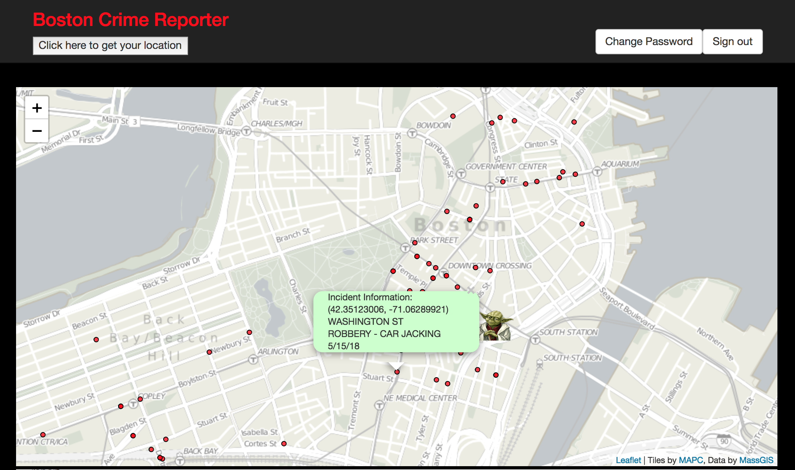

<h1><b>Boston Crime Tracker Application</b></h1>

 This is the client-side repo for the Crime Tracker application. This application allows users  to visualize 2018 robbery data in Boston. A user can also report a robbery and add that information to a database. The data for this project was downloaded from the City of Boston.

Check out the deplyed site: https://sehutchinson7.github.io/capstone-client/

Learn more about how Rails was used to power the back-end of the application. 
Back-end repo:
https://github.com/sehutchinson7/capstone-api

Data source: https://data.boston.gov/dataset/crime-incident-reports-august-2015-to-date-source-new-system

<h3> Background: </h3>
  
The goal for the project was to create an easy to use app that gives a user a visual representation of crime data in Boston. A user is able to go in and report a robbery or see their location in relation to other robberies for 2018.
  
<h3> Technologies Used: </h3>
<ul>
  <li>Atom Editor</li>
  <li>AJAX</li>
  <li>Boostrap</li>
  <li>CSS</li>
  <li>Excel</li>
  <li>Handlebars</li>
  <li>HTML</li>
  <li>Javascript</li>
  <li>Leaflet.js</li>
  <li>jQuery</li>
  <li>JSON</li>
  <li>QGIS</li>
  <li>Rails (back-end)</li>
</ul>
<h3> Project Description & Planning Process </h3>

 After a user signs up and signs in, they are able to add an incident to the database. A registered user can keep track of their incidents by clicking on the "View My Surveys" button. Additionally, a user can view all surveys by clicking the "View My Surveys" button. The user has the capability of updating or deleting their surveys, but not those created by other users.  The application is currently designed for a user to specifically enter robbery incident data into the database. A user must select robbery type from a drop-down of set categories: Bank, Car Jacking, Commercial, Home Invasion, Other, or Street.

<h5> Wireframes & User Stories</h5>

 The developer utilized white boarding and wireframes for organization and planning purposes:
<ul>
  <li><a href="https://imgur.com/lAbB90k">View Wireframe </a></li>
</ul>
<h5>User Stories</h5>
<ul>
  <li>As a user, I want to be able to sign up, sign in, change password and sign out</li>
  <li>As a user I want to report the following information about a robbery: time, date, location, robbery type, and description.</li>
  <li>As a user, I want to update or delete my reports and view other user inputs reports.</li>
  <li>As a user, I want to visualize crime in Boston by neighborhood, crime type.</li>
  <li>As a user, I want to assess areas in Boston that are more susceptible to robberies.</li>
  <li>As a user, I want to visualize my location in relation to robberies in Boston.</li>
</ul>
<h5>Data Preprocessing </h5>

The dataset was downloaded as a .CSV from the City of Boston (https://data.boston.gov/dataset/crime-incident-reports-august-2015-to-date-source-new-system). The data cleaning was cleaned in Microsoft Excel. For the scope of this project the dataset was limited to include robberies from January to May 24th, 2018*. The dataset was imported into QGIS version 3.0.3-Girona, an open source Geographic Information Systems (GIS) software that allows a user to visualize, edit and analyze GIS data. The .CSV file was imported into QGIS and converted to geojson.

Note: The dataset defines burglaries separately from robberies. More details about the data can be viewed at the City of Boston link.

<h5>Development</h5>
The robbery point date was converted to geojson, a file extension compatible with the Leaflet javascript library. Leaflet is a free javascript library that creates dynamic and interactive webmaps. Version 1.3.1 was downloaded using npm install and the points were converted to a layer format in order to adjust symbology.

The skeleton for the user crime report forms was created in html and style with css. The data structure for the forms mirrors a similar structure to the .csv file, with similar columns. Although a user is able to view their location on the map, they are not currently able to add their geolocated coordinates to the map. On one hand, this ensures data quality. Next steps would look at tying the report forms and map together.
<h3> Next Steps: </h3>

Next steps in designing the application will focus on the cartography for the webmap. The next version will include a legend and symbolize the point by robbery type.  Additionally, Leaflet provides the option of creating a Controller to allow for greater user interaction with the map, clicking layers on and off etc. These techniques will be explored in greater depth in the future. Another option would be to assess vulnerability by creating hot spot maps based on clustered point data.

The developer can be contacted at: sara@hutchinsongis.com
</ul>
